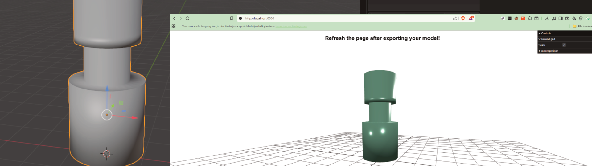
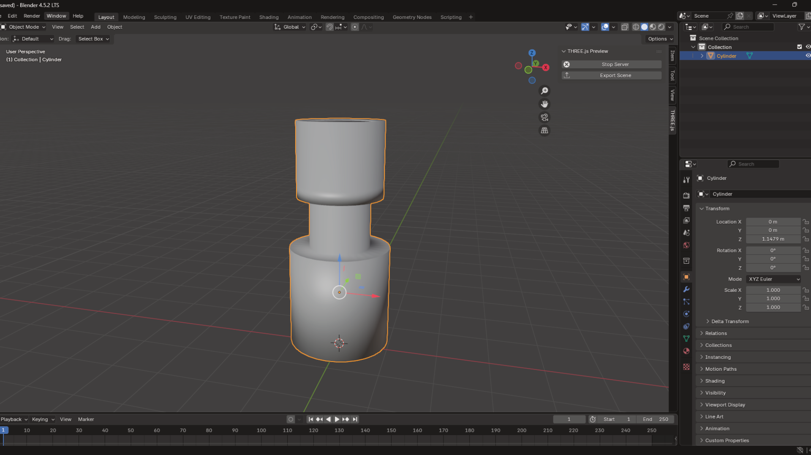
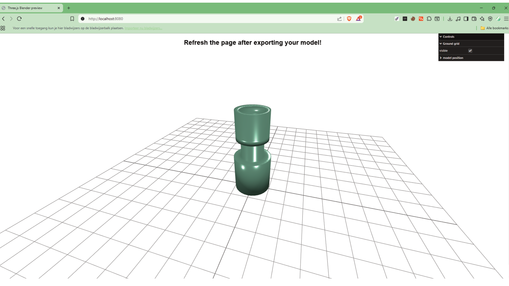

# Three.js Previewer - Blender Plugin

## Overview
The **Blender Three.JS Previewer plugin** is a development tool designed to let you **preview Blender scenes directly in Three.js** without the need for lengthy export cycles.  
This helps speed up iteration times when building web-based 3D experiences with Blender and Three.js.

---

## Features
- Fast preview of Blender scenes in a Three.Js environment
- Local webservere integration for quick reloading
- Minimizes time between Blender edits and browser testing

## Tested Versions
This add-on has been tested with the following versions:
- **Blender**: 4.5
- **Three.js**: r172
  (Other versions may also work, but these are the once used while developing the add-on)
---

## Screenshots

|  |  |
|------------------------------------------------------|----|

---
## Installation
1. Download the latest release found on the [releases](https://github.com/ZacharyPlayss/blender-three-js-preview/releases) page.
And download the 'blenderThreePreview.zip' folder.
2. Open up blender and go to **Edit > Preferences > Add-ons > Install**. Select the ZIP file downloaded in step 1 and enable the plugin.
3. The plugin is now installed succesfully!

## How do I use the plugin?
In blender you find a new "THREE.JS" window, in which you find a button for starting the server and one for exporting the model. 
Clicking the server start should open up a browser window showing a monkey mesh by default. When you clik the "export model" button the model gets exported. 
As of now manual refreshing of the browser window remains nessesary for changes to take affect.

### Why are the materials not displaying correctly in the previewer?

Blender and three.js have their own ways of utilizing material configuration. If you need any help with how certain materials are mapped between blender and three.js
You can use this handy [cheatsheet](https://cdn.pixel-capture.com/assets/images/blender_to_threejs_cheatsheet.png) created by [Valentin's coding book](https://www.youtube.com/@ValentinCoding).

---

## Contributing
Contributions are always welcome!

If you'd like to improve this project, here's how to get involved:
1. **Fork the repository** and create your branch from `main`.
2. **Make your changes** - wheter it's fixing bugs, adding features, improving docs or refactoring code.
3. **Write clear commit messages ([conventionalcommits](https://www.conventionalcommits.org/en/v1.0.0/)**) - When using software versions which differ from the main repository please include them in the commit description.
4. **Test your changes** Before submitting.
5. **Open a Pull Request** with a clear description of what you've done and why.

💡 Not a coder? 
You can still help out by:
- Reporting issues or suggesting new features
- Improving documentation
- Sharing the project with others

---

Made by [Zachary Van De Staey](https://github.com/ZacharyPlayss)
Contributions, issues and feature requests are welcome!

---
